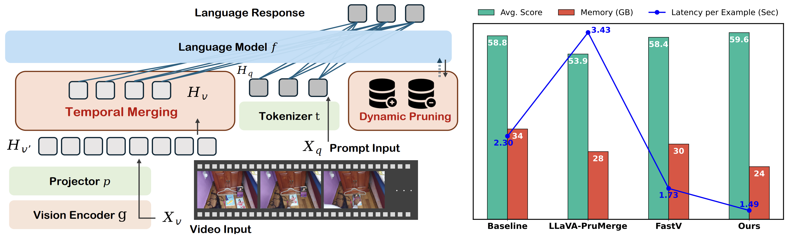
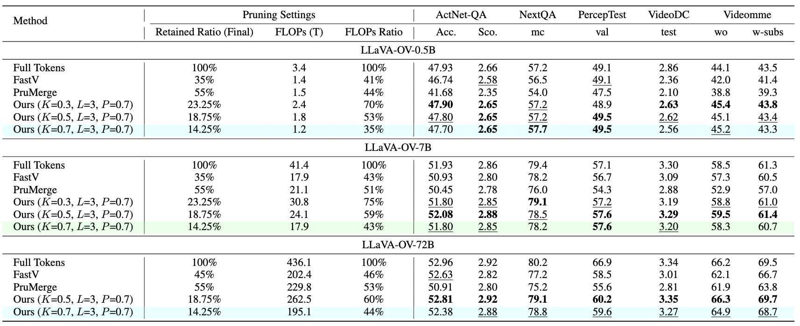
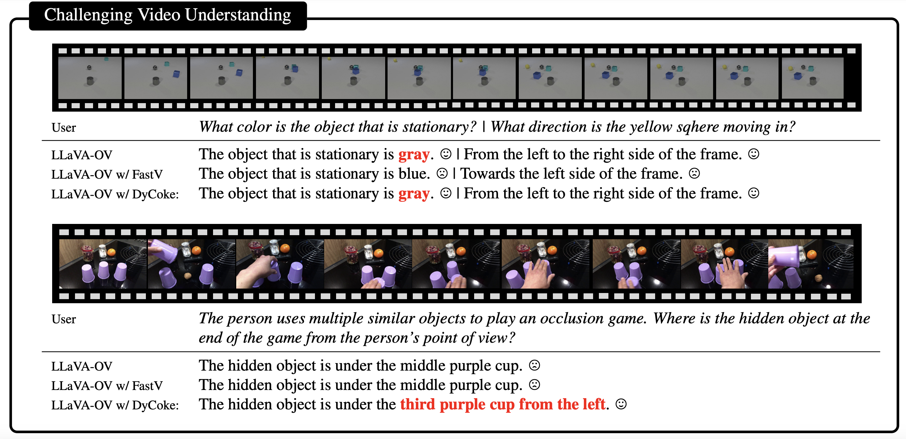

# DyCoke : **Dynamic Compression of Tokens for Fast Video Large Language Models**

Keda Tao, Can Qin, Haoxuan You, Yang Sui, Huan Wang, "DyCoke 🥤Dynamic Compression of Tokens for Fast Video Large Language Models"

[[Paper](https://arxiv.org/abs/2411.15024)]

#### 🔥🔥🔥 News

- **2024-11-22:** This repo is released.
- **2024-11-25**: **The paper was released.**

---

> **Abstract:** Video large language models (VLLMs) have significantly advanced recently in processing complex video content, yet their inference efficiency remains constrained because of the high computational cost stemming from the thousands of visual tokens generated from the video inputs. We empirically observe that, unlike single image inputs, VLLMs typically attend visual tokens from different frames at different decoding iterations, making a one-shot pruning strategy prone to removing important tokens by mistake. Motivated by this, we present DyCoke, a training-free token compression method to optimize token representation and accelerate VLLMs. DyCoke incorporates a plug-and-play temporal compression module to minimize temporal redundancy by merging redundant tokens across frames, and applies dynamic KV cache reduction to prune spatially redundant tokens selectively. It ensures high-quality inference by dynamically retaining the critical tokens at each decoding step. Extensive experimental results demonstrate that DyCoke can outperform the prior SoTA counterparts, achieving 1.5$\times$ inference speedup, 1.4$\times$ memory reduction against the baseline VLLM, while still improving the performance, with no training.

## ⚒️ TODO

* [x] Release Paper 
* [ ] Release code 
* [ ] Support more models

## 👀 Results on Video-Language Models

## Acknowledgement

This project is based on [LLavVA-NeXT](https://github.com/LLaVA-VL/LLaVA-NeXT). Thanks for their awesome work.

## Contact

If you have any questions, please feel free to contact with me at KD.TAO.CT@outlook.com
